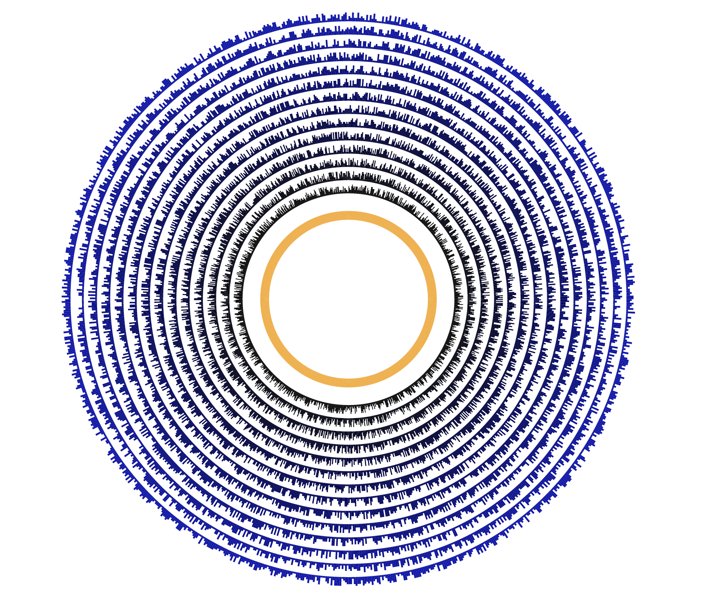

# d3-arcs

Simple program to create multiple concentric arcs with differring thickness (aka outer radius).
Upon refreshing the HTML page in your browser, you will see different outer arc with varying radii.
note: The demo gif of arcs_functional.html file. 

## sources: 
[original example source](https://bl.ocks.org/d3indepth/3d912bbaaebcf01a05b75d088a1c9976)

[another example from d3 docs](https://bl.ocks.org/d3indepth/b52f9ab1dde3a1953367395d10483be4)

[d2 shapes main repo docs](https://www.d3indepth.com/shapes/)

[random generator function of developer.mozilla.org/](https://developer.mozilla.org/en-US/docs/Web/JavaScript/Reference/Global_Objects/Math/random)

## sample output 

